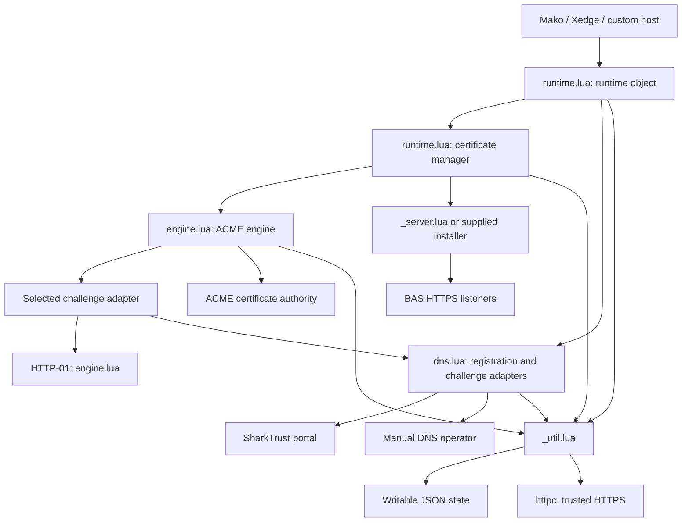
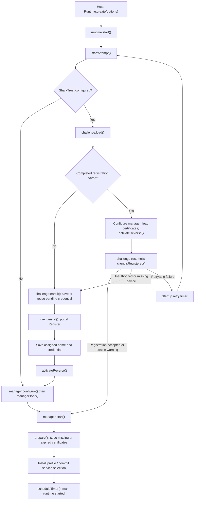
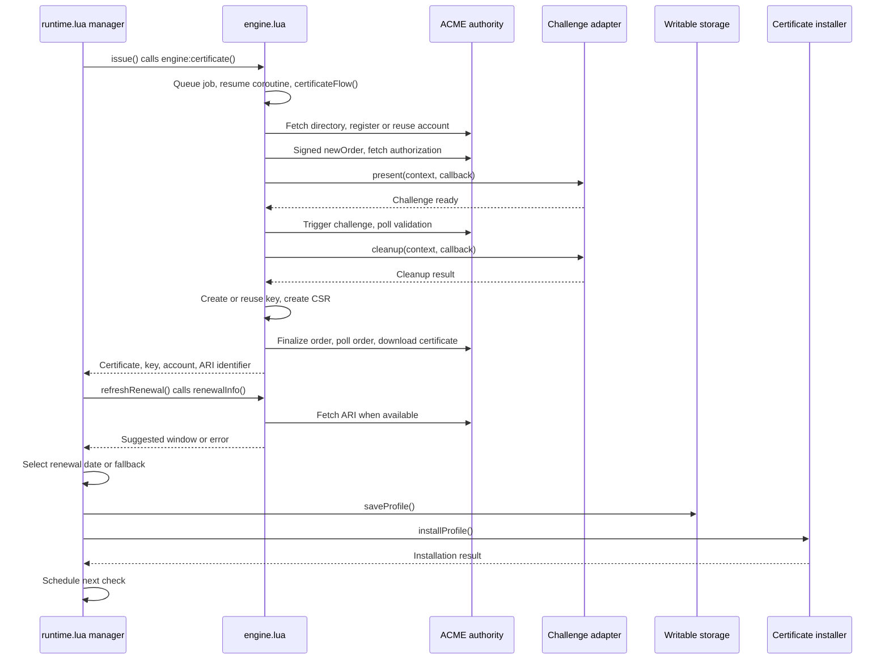
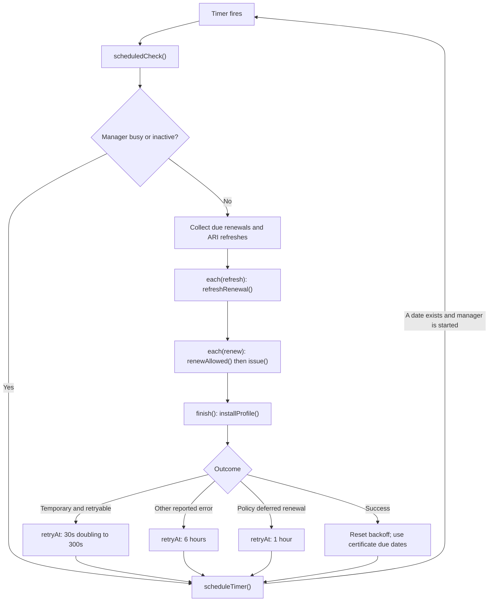

# ACME Client Architecture

This client obtains, installs, and renews Transport Layer Security (TLS) certificates using the Automatic Certificate Management Environment (ACME) protocol. Mako Server and Xedge supply configuration, writable storage, and host lifecycle hooks. The shared Lua implementation manages certificate issuance and renewal.

This specification defines the five-module implementation in `src/core/.lua/acme`, its control flow, persistent state, and lifecycle responsibilities. Detailed public contracts are defined in the [API guide](../doc/acme-client-public-api.md).

See also [ACME Token Generator Design](acme-tokengen.md)

## Module responsibilities

| Module | Responsibility |
| --- | --- |
| [runtime.lua](../src/core/.lua/acme/runtime.lua) | Composes the client through `create()`. Also contains the certificate manager exposed by `createManager()`: configuration, stored service profiles, certificate installation, renewal dates, timers, retries, and service switching. The runtime owns startup retry; the manager owns scheduled renewal retry. |
| [engine.lua](../src/core/.lua/acme/engine.lua) | Executes ACME transactions: directory discovery, account registration, signed requests, orders, challenge validation, certificate requests/downloads, revocation, and ACME Renewal Information (ARI). Serializes certificate jobs and manages software or Trusted Platform Module (TPM) keys. Contains the HTTP-01 challenge adapter. |
| [dns.lua](../src/core/.lua/acme/dns.lua) | Contains three related components. `createClient()` implements authenticated SharkTrust portal operations and optional reverse connections. `createSharkTrust()` adds persisted registration and automatic DNS-01 challenge handling. `createManual()` waits for an operator to publish a DNS record. `identity()` obtains the portal identity/proof configuration. |
| [_util.lua](../src/core/.lua/acme/_util.lua) | Private shared functions for trusted HTTP requests, error classification, protected callback invocation, service identity, table copying, and JSON file replacement/recovery. It reports transport errors; it does not schedule retries itself. |
| [_server.lua](../src/core/.lua/acme/_server.lua) | Private default certificate installer. Converts certificate/key records into SharkSSL certificates, builds a server TLS context, and updates existing IPv4/IPv6 HTTPS listeners. Restores TPM keys when needed. Custom hosts can supply their own installer. |

## Module Interactions

Arrows indicate calls or dependency use. The two objects inside `runtime.lua` have different lifecycle responsibilities.

The engine knows the narrow challenge interface: a type plus `present()` and `cleanup()` callbacks. It does not need to know whether a DNS record is installed through SharkTrust or by a person. HTTP-01 temporarily serves the challenge token under `/.well-known/acme-challenge/`.

Each configured domain has its own certificate record and issuance job. This code creates a single-domain order for each job, rather than combining the configured domains into one multi-domain order. In the normal SharkTrust runtime path, the portal-assigned name becomes the manager's domain list.

## Startup and saved state

`Runtime.create()` constructs the engine, selected challenge adapter, and manager. It does not start certificate work. `runtime:start()` activates the startup flow.

Without SharkTrust, the runtime configures and loads the manager directly. With SharkTrust, it first loads the device registration, enrolls if necessary, or confirms the saved registration. Confirmation also refreshes the device's local IP address, obtained from a connection to the portal, not the browser connection. An optional reverse connection is configured before manager startup.

The diagram shows the main successful paths and registration recovery. Other failures return through `startAttempt()`'s `done()` callback, which schedules another attempt while the runtime remains open. Error classification selects the retry delay; see [Life Cycle Management](#life-cycle-management).

The manager loads and installs a saved active profile before preparing replacements. Valid certificates can be reused. Certificates whose renewal date has arrived but which have not expired are picked up by the scheduler after startup. A different ACME directory uses a separate profile and requires an explicit rebuild through the service-switching path.

Default state is stored beneath the selected writable I/O root:

| Path | Contents |
| --- | --- |
| `acme/active.json` | Identifies the active service profile and ACME directory. |
| `acme/services/<serviceId>.json` | Account, certificate records, keys or TPM descriptors, and renewal metadata. The service ID is a hash of the ACME directory URL, separating production and staging profiles. |
| `acme/sharktrust.json` | Default registration store: portal identity, assigned name, device identifier, and credential. A supplied store can replace this; Xedge uses its configuration store. |

`_util.writeJson()` writes a temporary file and replaces the main file using a backup. `_util.readJson()` can recover from that backup. This is file replacement/recovery logic, not a database transaction across all state files and listener updates.

Software keys are stored with the profile. TPM keys are represented by descriptors that allow restoration before signing, creating a certificate signing request, or installing a certificate. The account uses an ECC P-256 key; certificate keys support ECC and RSA. Existing certificate keys are reused on renewal.

## Issuing or renewing a certificate

The manager's `issue()` calls `engine:certificate()`. The engine returns a job handle, queues the job if another certificate job is active, and reports completion through a callback. Accepting a job does not mean a certificate has been obtained.

A Certificate Signing Request (CSR) binds the requested name to the certificate key. ACME requests are signed with the account key and a server nonce. The engine retries a bad nonce once within the signed request. If an order reports that the account no longer exists, it registers again and retries that order once.

Certificate jobs use coroutines so challenge adapters can complete asynchronously. The automatic DNS adapter sets the TXT record through the portal, waits for its propagation delay (30 seconds by default), then completes `present()`. The manual adapter waits until the operator calls `continue()`; there is no automatic publication or deadline for that wait.

The engine cleans up challenges after validation and on failure/cancellation paths. An individual job can fail. The manager or runtime, rather than the engine's job queue, decides whether to attempt issuance again later.

## Renewal scheduling

When ARI provides a suggested window, the manager chooses a random renewal time within it. It schedules another ARI check using the server's retry interval, clamped to 60 seconds through one day. Without usable ARI, it calculates renewal from expiry: by default 22 days before expiration with a small random offset. If an ARI request fails, it uses that fallback and schedules another ARI check six hours later. If no certificate expiry can be determined, renewal is due immediately.

One timer covers the active profile. It selects the earliest renewal or ARI check unless a retry delay is already pending. Long delays are split by capping the timer duration and checking the due dates again when it fires.

The last installed certificate set remains in service while an issuance attempt fails. The default installer does not replace it with a self-signed default merely because the managed certificate has expired or because the record list is empty. Successful replacement records are converted into a new TLS context before listeners are updated. Serving an existing certificate does not guarantee that it is still valid or trusted by clients.

## Life Cycle Management

The runtime retries reported operational failures without an attempt limit while it remains open. Error classification determines the delay between attempts. Successful certificate issuance requires valid configuration, writable storage, and completion of the required network and callback operations.

### Startup and enrollment recovery

The runtime schedules another startup attempt after every reported
failure while it remains open. Temporary, retryable failures use exponential
backoff from 30 seconds to five minutes. Other failures, including an occupied
exact name, retry once per hour. There is no attempt limit. The initial callback
reports the failed attempt; `retryPending` shows that recovery remains
scheduled. Xedge uses that flag when reporting pending activation.

The DNS adapter saves a pending credential and registration request before
contacting SharkTrustX. On retry or restart, it reuses that credential. The
portal looks up the credential hash under its enrollment lock before allocating
a name. A match in the authenticated zone returns the existing registration;
otherwise it creates the device. The client verifies the returned credential
and saves completed registration. The portal stores only the credential hash; the client retains the credential in its registration store.

Reusing the saved credential recovers a lost enrollment response without allocating duplicate devices.
The portal must support credential-based recovery before the client is deployed. The lower-level client also supports
legacy enrollment without a supplied credential, for which a lost write/read
response remains `enrollment_state_unknown` with `retryable=false`.

If storage is formatted, corrupted beyond recovery, or removed by a factory
reset, a client may no longer possess its old credential. A new credential
requesting an occupied exact name receives `name_unavailable`. It retries hourly;
the old registration is never overwritten automatically. Each authenticated
exact-name conflict triggers an immediate email attempt to the portal's
configured log recipient. The email includes requested and registered device
metadata, reported local IP, and observed peer IP. Same-credential recovery is
not a conflict. Credentials, request proofs, and zone secrets are excluded.
An administrator can investigate and resolve the name conflict. Email delivery
depends on the configured SMTP service; delivery failure is logged.

Scheduled renewal uses these retry intervals: 30 seconds increasing
to five minutes for temporary, retryable errors; six hours for other reported
errors; one hour when renewal policy defers issuance. A failed domain does not
end the scheduled pass: other due domains are processed before installation
and rescheduling. ARI failure selects expiry-based renewal.

### Lifecycle Boundaries

Persistent retry means retrying completed failures. It does not guarantee a
certificate regardless of configuration, policy, or an operation that never
completes:

- Explicit stop/close and process exit stop the relevant work.
- Incorrect settings, lost credentials, or unreadable storage may require
  operator correction even though startup continues retrying.
- Manual DNS waits for the operator's `continue()` call.
- A challenge adapter or installer that never calls its completion callback can
  leave work pending. There is no general callback watchdog.
- The engine's default 600-second polling budget counts polling sleep intervals,
  not the entire issuance job or its HTTP/callback waits.
- Scheduling requires a retry date or certificate renewal/ARI date. It is not
  an unconditional scan of all configured names.

## Source References

- [runtime.lua](../src/core/.lua/acme/runtime.lua): `create()`, `createManager()`, `startAttempt()`, `prepare()`, `issue()`, `refreshRenewal()`, `scheduleTimer()`, `scheduledCheck()`.
- [engine.lua](../src/core/.lua/acme/engine.lua): `certificateMain()`, `certificateFlow()`, `waitFor()`, `poll()`, `session:signed()`, `finishJob()`.
- [dns.lua](../src/core/.lua/acme/dns.lua): `enrollmentError()`, `networkAddress()`, registration persistence, `present()`, and the manual adapter.
- [_util.lua](../src/core/.lua/acme/_util.lua): `transportError()`, HTTP request lifecycle, and JSON persistence.
- [_server.lua](../src/core/.lua/acme/_server.lua): certificate conversion and listener replacement.
- [Mako startup](../src/mako/.config) and [Xedge lifecycle](../src/xedge/.lua/xedge.lua): runtime construction, startup, and shutdown.
- [Integration architecture guide](../doc/acme-client-architecture.md): additional packaging and integration context.

## Verification Reference

Deployment records, test coverage, and validation limitations are maintained separately in [ACME retry test results](ACME-retry-test-results.md).
